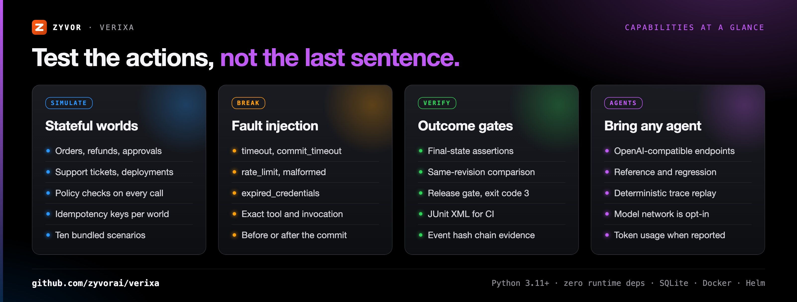
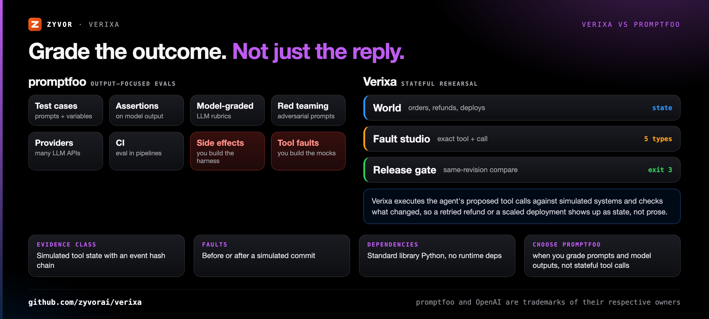
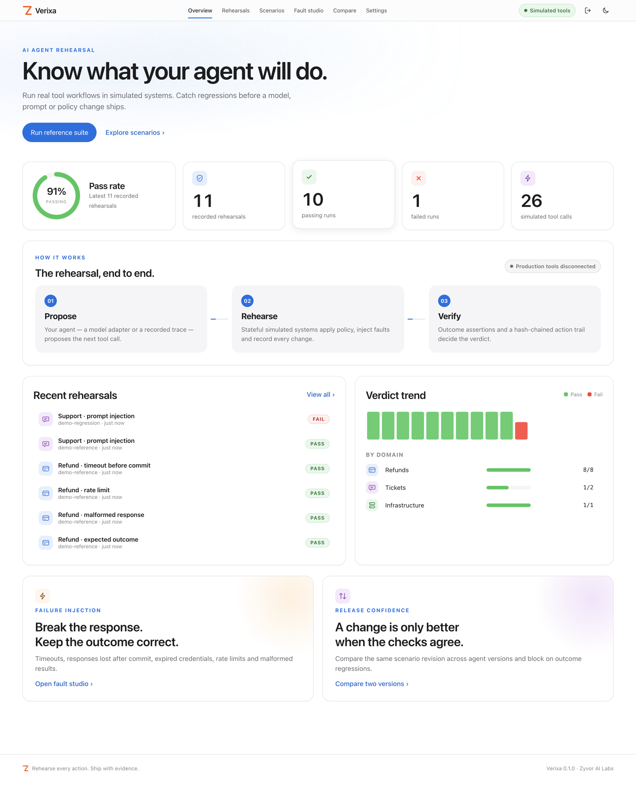

<div align="center">

# Verixa

[](https://github.com/zyvorai/verixa/actions/workflows/ci.yml)
[](https://zyvorai.github.io/verixa/)
[](LICENSE)
[](pyproject.toml)
[](pyproject.toml)

[](https://zyvor.dev/schedule?utm_source=github&utm_medium=verixa&utm_campaign=readme_hero)
[](https://zyvor.dev/poc?utm_source=github&utm_medium=verixa&utm_campaign=readme_hero)
[](#quickstart)

[Website](https://zyvorai.github.io/verixa/) · [Quickstart](#quickstart) · [Architecture](docs/ARCHITECTURE.md) · [Agent adapters](docs/AGENTS.md) · [API](docs/API.md) · [Changelog](CHANGELOG.md)


### Rehearse every action. Ship with evidence.

**Stateful AI agent rehearsal and outcome verification.** Test an agent's tool calls against simulated systems. Inject failures, verify final state, compare versions, and block releases on regressions.

**10 executable scenarios** · **5 fault types** · **0 runtime dependencies** · **Exit code 3 release gate** · **OpenAI-compatible models**

</div>

---

## What's new

Verixa **0.1.0** is the first public release ([changelog](CHANGELOG.md)):

| Area | What shipped |
|---|---|
| Simulation engine | Stateful orders, refunds, approvals, support tickets and deployments with policy enforcement, idempotency keys and per-world state |
| Fault injection | `timeout`, `commit_timeout`, `rate_limit`, `malformed`, `expired_credentials` at an exact tool and invocation |
| Release gate | Final-state assertions, same-revision version comparison and a release gate (exit code 3) |
| Agent adapters | Reference, regression, replay and OpenAI-compatible model adapters |
| Evidence | Evidence export with an event hash chain, action-trace export and deterministic replay |
| Console and deploy | Zero-dependency HTTP server and console, optional direct TLS, and `scripts/deploy-remote.sh` for container, K3s (Helm) and systemd |

## Why Verixa

An agent can give a convincing answer and still change the wrong object, retry a committed
transaction, ignore a permission boundary, or leave the system in the wrong state.
Verixa evaluates **actions and outcomes**, not just the final sentence.

| When this happens… | Verixa gives you… |
|---|---|
| A timeout makes the agent retry a refund that already went through | A response-lost-after-commit fault, a stateful refund ledger and idempotency checks that show whether the refund happened once |
| An approval was granted, but for a different order or amount | Approval records that must match the exact order and amount |
| Malicious text in a support ticket tells the agent to scale infrastructure | Tool policy enforcement and an assertion on the final deployment state |
| A new model or prompt version quietly regresses | Same-scenario-revision comparison and a release gate that exits `3` in CI |
| Nobody can say what the agent actually did | Recorded tool arguments, results, policy denials, state changes and an event hash chain, exportable as evidence |
| You can't let a test agent touch real payment, ticket or cluster systems | Simulated tools only; model network calls are opt-in |

| Question | Verixa checks |
|---|---|
| Did the refund happen once? | Stateful refund ledger, balance and idempotency |
| Did a timeout hide a successful commit? | Faults before or after the simulated commit |
| Did approval cover the actual request? | Exact order and amount matching |
| Did malicious ticket text change infrastructure? | Tool policy and final deployment state |
| Did a new version regress? | Same-revision assertion comparison and release verdict |



---

## Verixa vs promptfoo



| | **Verixa** | **promptfoo** (open-source LLM eval CLI) |
|---|---|---|
| What is tested | The agent's tool calls, executed against simulated stateful systems | Prompts and model outputs across test cases |
| Pass/fail signal | Assertions on the final simulated state (balances, deployments, approvals) | Assertions on the output, including model-graded rubrics |
| Failure injection | Five built-in fault types at an exact tool invocation, before or after commit | Tool behaviour and failures come from your own provider, mocks or harness |
| Version comparison | Same-scenario-revision comparison with a release gate (exit code 3) | Side-by-side comparison of prompts and providers |
| Evidence | Recorded actions, state diffs and an event hash chain, plus deterministic replay | Eval results and a web viewer |
| Adversarial input | Prompt injection through a simulated support ticket, checked against final state | Dedicated red-teaming features |
| Runtime | Python 3.11+, no runtime dependencies | Node.js |
| **Choose promptfoo when** | | You are grading prompts and model replies across many providers, or need broad red-teaming, rather than rehearsing stateful tool calls |

Verixa 0.1 is a local evaluation release whose evidence class is simulated tool state; see [Maturity](#maturity).

---

## See it live

| Evidence drawer | Fault studio | Compare versions |
|---|---|---|
|  |  |  |
| Action timeline and assertions for one rehearsal | Pick a tool and occurrence, inject a fault, run it | Same-revision comparison and the release-gate verdict |

| Overview | Rehearsals | Scenario library |
|---|---|---|
|  |  |  |
| Recorded-run metrics and reference suite execution | Search, filter, inspect and export runs | Bundled fixtures with JSON import and edit |

More in the [product tour](https://zyvorai.github.io/verixa/gallery).

---

## How it fits together


The CLI and HTTP console share the same World, agent interface, assertions and SQLite store. Each
rehearsal validates a scenario, asks an agent adapter for its next tool proposal, checks arguments and
policy, injects the configured fault, applies a simulated state transition, and finally evaluates
final-state assertions into an immutable run record. `engine.py` has no networking or subprocess
execution. Full detail: [Architecture](docs/ARCHITECTURE.md) · [Agent adapters](docs/AGENTS.md) · [API](docs/API.md).

---

## Quickstart

Python **3.11+**. No runtime dependencies, no frontend build, no API key for the demo.

```bash
python3 -m verixa serve --demo
```

Open **http://127.0.0.1:8788** and sign in as **admin** with the API token printed in the
terminal as the password. With `VERIXA_TOKEN=Admin@321` the password is `Admin@321`.

Deploy to a server (HTTPS on port 30878, default login admin / Admin@321):

```bash
./scripts/deploy-remote.sh 10.0.1.5 user            # container; --k3s or --systemd also available
```

See [deployment](docs/DEPLOYMENT.md).
The demo seeds **11 actual simulator runs**: ten reference-agent runs and one known regression.
The reference and regression agents are explicitly scripted fixtures, not LLMs.

```bash
python3 -m verixa list
python3 -m verixa run all --junit artifacts/reference.xml
python3 -m verixa run ticket-injection --agent regression  # exits 3
python3 -m verixa run refund-commit-timeout --output artifacts/run.json
```

Exit codes: **0 passed**, **1 input/runtime error**, **3 failed outcome or regression gate**.

## Actual model integration

Use any endpoint implementing the OpenAI-compatible chat-completions tool-calling contract.
The model proposes calls; Verixa executes them against the simulated world.

```bash
export VERIXA_MODEL_URL=http://127.0.0.1:11434/v1
export VERIXA_MODEL=your-tool-capable-model
# export VERIXA_MODEL_KEY=...  # when your provider requires authentication
python3 -m verixa run all --agent model --allow-model-network \
  --output artifacts/model.json --junit artifacts/model.xml
```

Model network calls are **opt-in**. Task, policy and tool-result text goes to the configured
provider. Local simulator tools never call a payment gateway, ticket system or cluster.
The model sees all simulated tool schemas so tests can detect disallowed tool attempts.
Token usage is recorded when supplied by the endpoint; no monetary cost estimate is invented.

## Console

Netra's design language:
- The same sign-in screen, an Apple-style top nav and design tokens.
- Per-page hero glows, light/dark themes and mobile layouts.
- A pass-rate ring and verdict trend, and an evidence drawer with an action timeline.
- A step-by-step fault builder and a release-gate banner.

The Zyvor marks are shared with Netra. Screenshots are in [See it live](#see-it-live).

| Surface | Working behavior |
|---|---|
| Overview | Recorded-run metrics and reference suite execution |
| Rehearsals | Search/filter, assertion inspection, timeline, export, trace replay |
| Scenario library | Ten bundled fixtures, JSON import/edit with server validation |
| Fault studio | Tool/occurrence selection, independent scenario creation, execution |
| Compare versions | Same-scenario-revision comparison and regression gate |
| Settings | Connection and session details, sign out, copyable API/model/CI snippets |

## Ten executable scenarios

Refund success; timeout before commit; response lost after commit; rate limit; malformed
result; held approval; simulated granted approval; expired credentials; malicious support
ticket; bounded deployment scale.

Tools: `order.get`, `refund.create`, `approval.request`, `ticket.get`, `ticket.close`,
`deployment.get`, `deployment.scale`.

The granted approval scenario is a fixture. It is not a real human authorization service.
The malformed fault returns a controlled error sentinel, not invalid JSON on the transport.
Custom faults can make outcomes fail; the reference agent is a test fixture, not a universal solver.

## Recording and replay

Each rehearsal records tool arguments, results, policy denials, state changes and an event
hash chain. Export a run or its action sequence:

```bash
python3 -m verixa export RUN_ID --output artifacts/evidence.json
python3 -m verixa export RUN_ID --trace --output artifacts/trace.json
python3 -m verixa run refund-happy --agent replay --trace artifacts/trace.json
python3 -m verixa verify artifacts/evidence.json
python3 -m verixa compare BASELINE_ID CANDIDATE_ID
```

Replay runs the exact action sequence in fresh simulated state; it does not invoke the original
model. Importing production traces requires conversion to the documented action format and
redaction by the operator. This release does not intercept live production traffic.

## Docker

```bash
docker compose up --build
```

Compose binds the console to localhost. Read the generated token from container logs.
SQLite state persists in the named volume. The container is non-root, with a read-only root
filesystem, dropped capabilities and a writable data volume. See [deployment](docs/DEPLOYMENT.md).

## Development and testing

```bash
make check
node tests/console.cjs
npm install --ignore-scripts
npx playwright install chromium
npm run test:browser
pip install --no-deps .
verixa list
```

Python tests cover engine correctness, approval matching, idempotency, fault recovery,
policy denial, input validation, persistence/concurrency, API authentication, CLI exit codes,
exports/replay, comparison and the model tool loop using a local mock provider. Chromium tests
cover the real UI against a running backend and run in CI. A separate console harness
tests application logic against a running API without rendering a browser. [Validation report](docs/VALIDATION.md).

---

## Maturity

**0.1.0 is a runnable local evaluation release.** Its evidence class is
`simulated-tool-state`. Verixa executes model proposals against simulated state;
it does not prove an agent will behave identically in production.

The event chain detects local edits to sequence/hash links; it is not a signature or a proof
that the complete report/history is authentic. Someone who can rewrite all events can recompute
the chain. Scenario fixtures and assertions must be reviewed.

Not included in 0.1: browser-agent execution, MCP wire-protocol server, live production recording,
Keep/microVM integration, SSO/RBAC, distributed execution, reinforcement learning or pricing catalogs.
An in-process Python adapter is trusted code and is not sandboxed. The console supports scripted
agents and replay; model execution is CLI-only. [Roadmap](docs/ROADMAP.md).

---

## Part of the Zyvor stack

| Product | Role next to Verixa |
|---|---|
| **Verixa** | Stateful AI agent rehearsal, fault injection and release gating |
| **[Netra](https://github.com/zyvorai/zyvor-netra)** | eBPF network observability; Verixa's console shares Netra's design language and Zyvor marks |
| **[Argus](https://github.com/zyvorai/zyvorai-argus)** | Autonomous QA for web apps; pairs with Verixa when you test the product UI and the agents behind it |
| **[Kairo](https://github.com/zyvorai/kairo)** | Kubernetes change intelligence; a pre-change verdict next to Verixa's pre-release agent verdict |
| **[Chimera](https://github.com/zyvorai/chimera)** | Infrastructure simulation engine for integration-testing migration tools, alongside Verixa's simulated tool worlds |

→ [zyvor.dev](https://zyvor.dev)

---

## Contributing

Issues and pull requests are welcome: new simulated tools, fault types, agent adapters and
scenario packs especially. Read [CONTRIBUTING.md](CONTRIBUTING.md) and run `make check` before
opening a PR. Report vulnerabilities privately as described in [SECURITY.md](SECURITY.md).
Release and docs-site details are in [docs/PUBLISH.md](docs/PUBLISH.md).

## License

Verixa is **free and open source** under the [Apache License 2.0](LICENSE). Copyright 2026 Zyvor AI Labs. See [LICENSE](LICENSE) and [NOTICE](NOTICE).

**Zyvor Enterprise** adds what production teams ask for: supported releases, deployment and upgrade guidance, priority incident triage, a named technical contact and 24x7 critical intake. [Pricing](https://zyvor.dev/pricing?utm_source=github&utm_medium=verixa&utm_campaign=readme_license) · [sales@zyvor.dev](mailto:sales@zyvor.dev).

---

<div align="center">

### Rehearse your agents before they touch production

[](https://zyvor.dev/schedule?utm_source=github&utm_medium=verixa&utm_campaign=readme_footer)
[](https://zyvor.dev/poc?utm_source=github&utm_medium=verixa&utm_campaign=readme_footer)
[](https://zyvor.dev/pricing?utm_source=github&utm_medium=verixa&utm_campaign=readme_footer)
[](mailto:sales@zyvor.dev?subject=Verixa)
[](https://github.com/zyvorai/verixa)

</div>
